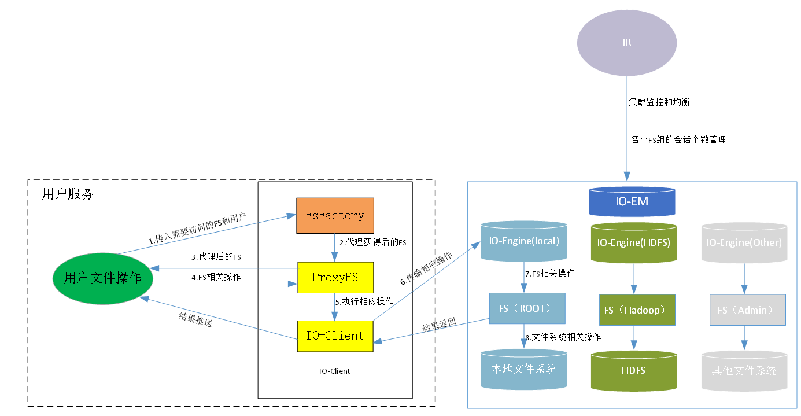

## 1 背景

通常用户启动一个JVM进程后，只具备启动用户的文件读写权限。

如：用户A在linux服务器上面启动一个JVM进程，如果该用户不是root (超级用户)的话，只能访问到该服务器上的本地文件，且只能对用户A的文件有操作权限。

但是很多场景下，我们通过用户A启动JVM进程，希望在文件权限不扩散的情况下，能访问本地文件系统的其他用户文件。

同时，如何做到在本地没有安装HDFS的情况下，能访问HDFS文件系统？

如何避免用户创建Linux用户，就可以访问该用户在HDFS上的相关文件？

## 2 思路

通过在远程服务器上，启动该文件系统的引擎管理器(IO-EngineManager)([什么是EngineManager?](/architecture/ujes/ujes_design.md))，并提供兼容统一的客户端API，让用户访问到远程的文件系统。

整个架构如下图所示：

## 3 实现

(1) 用户A调用远程文件系统的客户端(IO-Client) 的API，通过传入需要访问的文件路径(FsPath)和需要代理的用户B给IO-Client；

(2) 客户端(IO-Client)拿到FsPath和代理用户B获得需要代理的文件系统(ProxyFS)。

(3) 用户A通过ProxyFS对代理用户B的文件进行操作，如果下面步骤的权限校验通过，则可以执行文件的增删读写等操作。

(4) 用户A通过ProxyFS的操作会传给IO-Client，并通过网络传输到远程的文件系统服务，在传输过程中会通过智能路由服务(IR)获得负载较低的远程文件服务(IO-Engine)。

(5) 远程文件服务(IO-Engine)拿到IO-Client传过来的操作后，会进行安全规则判断，最先判断传过来的Token是否合法，接着判断IP是否合法，接着判断用户A是否有权限代理到用户B进行文件操作。

(6) 接着IO-Engine会获取到超级用户的Fs，通过Fs访问实际的文件系统，对用户B的文件进行操作。因为IO-Engine服务是超级用户启动的，所以可以访问所有用户的文件并操作。

(7) IO-Engine操作完用户B的文件操作后返回结果给到IO-client，进而将结果返回给用户A，代理远程访问文件的完整流程就结束了。

## 4 说明

上图中的引擎管理器(IO-EM)服务负责对IO-Engine服务的起停。

上图中智能路由服务(IR)负责判断各个IO-Engine的负载情况，并对IO-Client发送那个过来的请求进行负载均衡转发，如果所有的IO-Engine都负载过高则通知IO-EM启动新的IO-Engine服务，负载低的时候则通知IO-EM对空闲 IO-Engine服务进行停止。

**通过上面的流程可知：**

从第(5)点可知，可以实现对权限进行完全可控，用户也可以自己实现相应的安全规则进行配置；

从通过访问的远程文件系统服务可以实现类似于共享存储的功能；

从第(1)和(2)点可以通过传入的FS类型不一样从而可以支持多种文件系统。
