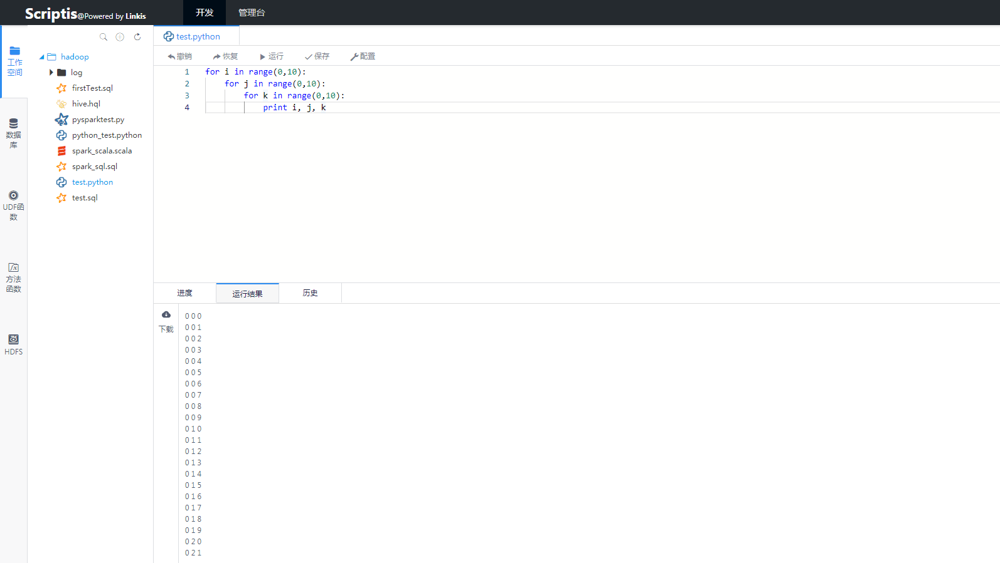
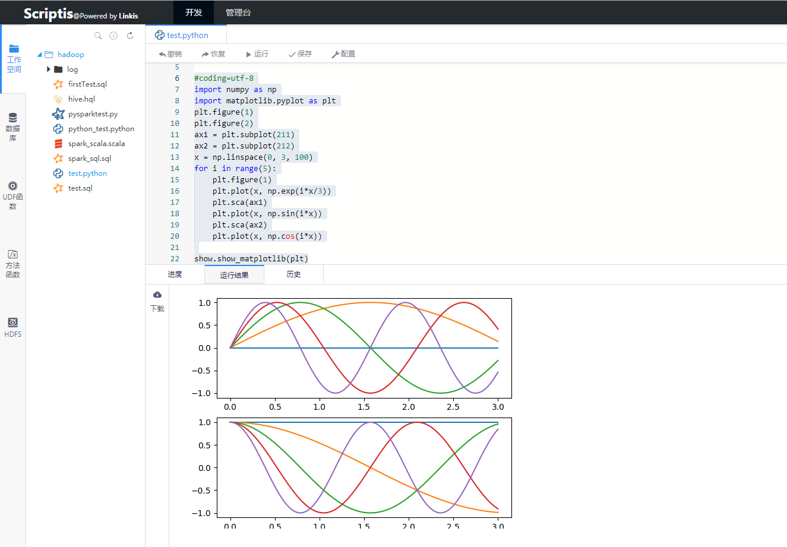

## 1 Python引擎的使用

&nbsp;&nbsp;&nbsp;&nbsp;&nbsp;&nbsp;&nbsp;&nbsp;当前大数据平台的很多用户选择使用python进行数据分析，所以Linkis原生就实现了python执行引擎。

&nbsp;&nbsp;&nbsp;&nbsp;&nbsp;&nbsp;&nbsp;&nbsp;用户使用Linkis提供的python引擎，可以向服务器提交单机的python程序并执行，python引擎会将执行的日志和打印出的结果展示给用户查看。

&nbsp;&nbsp;&nbsp;&nbsp;&nbsp;&nbsp;&nbsp;&nbsp;想要使用Linkis系统执行python程序，需要下载Linkis的release安装包并配置、安装并启动指定的指定的微服务。

### 1.1 环境变量配置

&nbsp;&nbsp;&nbsp;&nbsp;&nbsp;&nbsp;&nbsp;&nbsp;Python的执行原则上是不需要指定hadoop生态圈的环境变量，如果您希望将结果集存储到hdfs中，还需要配置HADOOP_HOME和HADOOP_CONF_DIR的配置信息。

您可以在/home/${USER}/.bash_rc 或 linkis-ujes-spark-enginemanager/conf目录中的 linkis.properties配置文件中设置。

```properties
HADOOP_HOME=${真实的hadoop配置目录}
HADOOP_CONF_DIR=${真实的hadoop安装目录}
```

### 1.2 依赖服务启动

Python引擎的启动，需要依赖以下的Linkis微服务:

- 1)、Eureka: 用于服务注册于发现。
- 2)、Linkis-gateway: 用于用户请求转发。
- 3)、Linkis-publicService: 提供持久化、udf等基础功能。
- 4)、Linkis-ResourceManager:提供Linkis的资源管理功能。

### 1.3	自定义参数配置

&nbsp;&nbsp;&nbsp;&nbsp;&nbsp;&nbsp;&nbsp;&nbsp;Linkis开放了接口，可以让用户设置引擎的相关参数，以便更自由地根据集群信息进行配置。

&nbsp;&nbsp;&nbsp;&nbsp;&nbsp;&nbsp;&nbsp;&nbsp;比如一个引擎管理器可以启动多少数量的引擎或者总共可以使用多少内存等。

&nbsp;&nbsp;&nbsp;&nbsp;&nbsp;&nbsp;&nbsp;&nbsp;用户可以通过设置下表的参数来进行:

|  参数名称 | 参考值 |  说明 |
| ------------ | ------------ | ------------ |
| wds.linkis.enginemanager.memory.max  | 40G|  用于指定hiveEM启动的所有引擎的客户端的总内存 |
| wds.linkis.enginemanager.cores.max  | 20 |  用于指定hiveEM启动的所有引擎的客户端的总CPU核数 |
| wds.linkis.enginemanager.engine.instances.max  | 10  |  用于指定hiveEM可以启动的引擎个数 |

### 1.4 python执行路径的确定

&nbsp;&nbsp;&nbsp;&nbsp;&nbsp;&nbsp;&nbsp;&nbsp;用户集群中的python环境差异是很大的，Liniks推荐用户使用anaconda的发行版本。

&nbsp;&nbsp;&nbsp;&nbsp;&nbsp;&nbsp;&nbsp;&nbsp;另外用户可以在pythonEngineManger的配置文件linkis-engine.properties中指定python解释器的路径，具体方式为

```
python.script=${真实的python解析器路径,如/usr/bin/python}
```

### 1.5 前端部署

&nbsp;&nbsp;&nbsp;&nbsp;&nbsp;&nbsp;&nbsp;&nbsp;上述微服务启动部署启动成功之后，用户如需要通过web浏览器来提交自己的python代码。可以通过部署配置另一款开源的前端产品[Scriptis](https://github.com/WeBankFinTech/Scriptis/blob/master/docs/zh_CN/ch1/%E5%89%8D%E5%8F%B0%E9%83%A8%E7%BD%B2%E6%96%87%E6%A1%A3.md)，该产品可以让使用者能够在web页面上编辑、提交执行代码，并能够实时的接收后台给的信息。

### 1.6运行实例

&nbsp;&nbsp;&nbsp;&nbsp;&nbsp;&nbsp;&nbsp;&nbsp;在web浏览器中，打开scriptis的地址，用户可以在左侧栏的工作空间新建python脚本并在脚本编辑区域编写脚本代码，编写完成之后，点击运行，就可以将自己的代码提交到Linkis后台执行，提交之后，后台会通过websocket方式实时将日志、进度、状态等信息推送给用户。并在完成之后，将结果展示给用户。

<br/>
图2 Python运行效果图2

<br/>
图3 Spark运行效果图2

## 2 Python引擎的实现方式

&nbsp;&nbsp;&nbsp;&nbsp;&nbsp;&nbsp;&nbsp;&nbsp;Linkis-Python执行引擎的实现，是参照[如何实现一个新引擎](/development/new_engine_conn.md)实现了Entrance、EngineManager和Engine三个模块的必要接口。

&nbsp;&nbsp;&nbsp;&nbsp;&nbsp;&nbsp;&nbsp;&nbsp;其中执行模块的实现是采用了py4j框架，让python执行器与JVM进行交互，当用户提交代码之后，JVM通过py4j框架将代码提交到python解释器进行执行，并从python进程中得到输出的结果或者错误信息。

&nbsp;&nbsp;&nbsp;&nbsp;&nbsp;&nbsp;&nbsp;&nbsp;具体的，可以查看python执行源代码中的python.py源代码，里面有Linkis定义的若干用于进程交互的python方法。


## 3 未来的目标

1.部署方式更加简单，尝试使用容器化的方式。
2.支持spark jar包方式的提交
3.更好地支持spark的yarn-cluster方式的提交。
