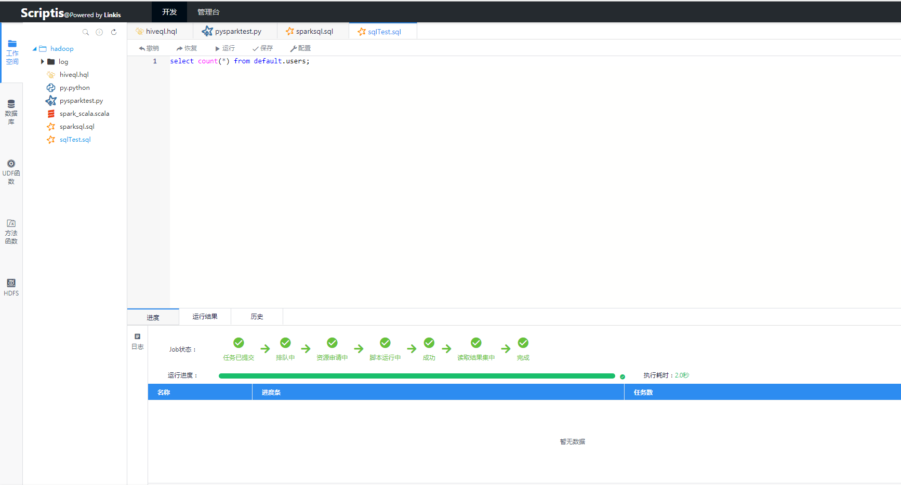
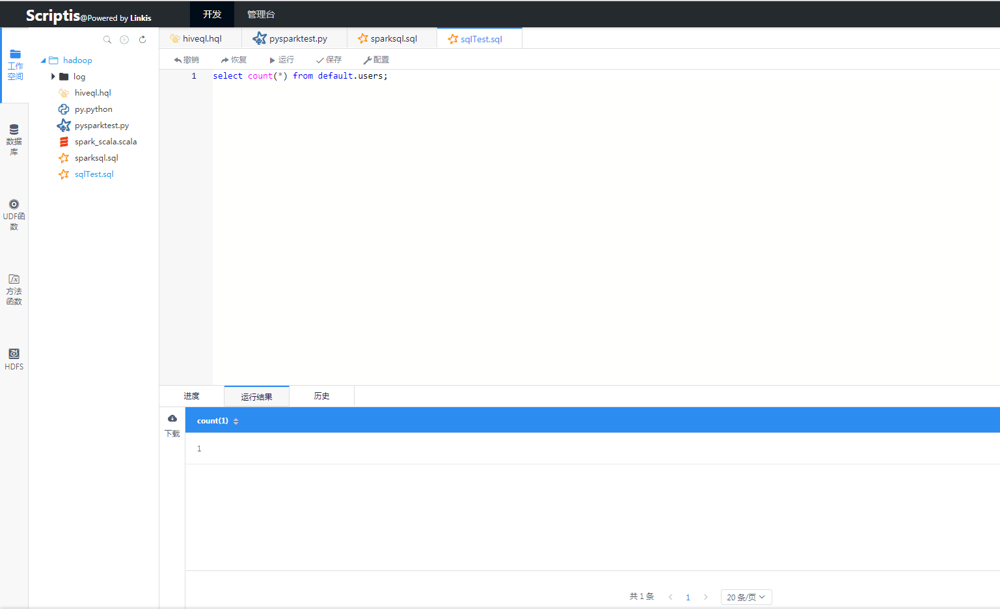
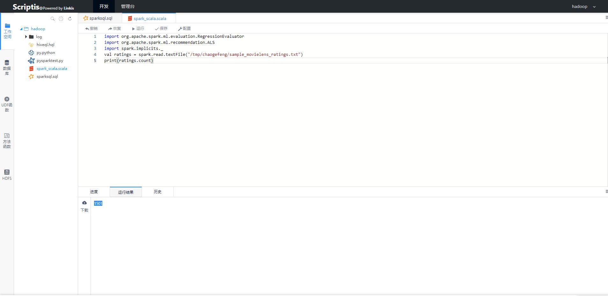

## 1 Spark引擎的使用
&nbsp;&nbsp;&nbsp;&nbsp;&nbsp;&nbsp;&nbsp;&nbsp;Linkis的Spark执行引擎为用户提供了向Yarn集群提交spark作业并反馈日志、进度、状态和结果集的能力。

&nbsp;&nbsp;&nbsp;&nbsp;&nbsp;&nbsp;&nbsp;&nbsp;Spark执行引擎支持用户提交sparksql、pyspark以及scala三种类型的作业，默认采用yarn-client方式提交作业，并以引擎的形式为用户维系一个或多个spark会话。

&nbsp;&nbsp;&nbsp;&nbsp;&nbsp;&nbsp;&nbsp;&nbsp;用户下载Linkis的release包并解压安装之后，需要正确启动若干特定的服务才能用于执行spark作业。

&nbsp;&nbsp;&nbsp;&nbsp;&nbsp;&nbsp;&nbsp;&nbsp;下面是具体步骤。

### 1.1 环境变量配置

&nbsp;&nbsp;&nbsp;&nbsp;&nbsp;&nbsp;&nbsp;&nbsp;Spark引擎依赖的环境变量:HADOOP_HOME、HADOOP_CONF_DIR、HIVE_CONF_DIR、SPARK_HOME以及SPARK_CONF_DIR。

&nbsp;&nbsp;&nbsp;&nbsp;&nbsp;&nbsp;&nbsp;&nbsp;在启动SparkEngineManager的微服务之前，请确保以上环境变量已经设置。

&nbsp;&nbsp;&nbsp;&nbsp;&nbsp;&nbsp;&nbsp;&nbsp;如果您没有设置，请先在/home/${USER}/.bash_rc 或 linkis-ujes-spark-enginemanager/conf目录中的 linkis.properties配置文件中设置。如以下所示
```properties
  HADOOP_HOME=${真实的hadoop home}
  HADOOP_CONF_DIR=${真实的hadoop配置目录}
  HIVE_CONF_DIR=${真实的hive配置目录}
  SPARK_CONF_DIR=${真实的hive配置目录}
  SPARK_HOME=${真实的spark安装目录 }
```

### 1.2 启动依赖服务

Spark引擎的启动，需要依赖以下的Linkis微服务:

- 1)、Eureka: 用于服务注册于发现。
- 2)、Linkis-gateway: 用于用户请求转发。
- 3)、Linkis-publicService: 提供持久化、udf等基础功能。
- 4)、Linkis-ResourceManager:提供Linkis的资源管理功能。

### 1.3	自定义参数配置

启动spark的相关微服务之前，用户可以设置关于spark引擎的相关配置参数。

Linkis考虑到用户希望能够更自由地设置参数，提供了许多的配置参数。

下表有一些常用的参数，Spark引擎支持配置更多的参数以获得更好的性能，如您有调优需求，欢迎阅读调优手册。

用户可以在linkis.properties中配置这些参数。


|  参数名称 | 参考值 |  说明 |
| ------------ | ------------ | ------------ |
| wds.linkis.enginemanager.memory.max  | 40G|  用于指定sparkEM启动的所有引擎的客户端的总内存 |
| wds.linkis.enginemanager.cores.max  | 20 |  用于指定sparkEM启动的所有引擎的客户端的总CPU核数 |
| wds.linkis.enginemanager.engine.instances.max  | 10  |  用于指定sparkEM可以启动的引擎个数 |


### 1.4 前端部署

上述微服务部署启动成功后，用户如需通过web浏览器来提交自己的sparkSQL、pyspark或Scala代码，可以通过部署配置微众另一款开源的前端产品[Scriptis](https://github.com/WeBankFinTech/Scriptis/blob/master/docs/zh_CN/ch1/%E5%89%8D%E5%8F%B0%E9%83%A8%E7%BD%B2%E6%96%87%E6%A1%A3.md)，该产品让用户能在web页面上编辑、提交代码，并能够实时接收后台给的信息。

另外，Scriptis还有一个管理台功能，用于配置spark引擎的启动参数。

### 1.5 spark启动参数配置

Scriptis页面为我们提供了可以设置启动参数的配置页面，其中可以设置Driver的内存大小，以及executor的个数以及内存和CPU核数等，这些参数都会被读取，用于启动一个spark引擎。

<br/>
图1 管理台配置界面

### 1.6 运行实例

在web浏览器中，打开scriptis的地址，用户可以在左侧栏的工作空间新建sql、scala或者pyspark脚本，在脚本编辑区域编写完脚本代码之后，点击运行，就可以将自己的代码提交到Linkis后台执行，提交之后，后台会通过websocket方式实时将日志、进度、状态等信息推送给用户。并在完成之后，将结果展示给用户。

<br/>
<center>图2 Spark运行效果图1</center>

<br/>
图3 Spark运行效果图2

<br/>
图4 Spark运行效果图3

## 2 Spark引擎的实现方式

&nbsp;&nbsp;&nbsp;&nbsp;&nbsp;&nbsp;&nbsp;&nbsp;Linkis-Python执行引擎的实现，是参照[如何实现一个新引擎](/development/new_engine_conn.md)实现了Entrance、EngineManager和Engine三个模块的必要接口。

&nbsp;&nbsp;&nbsp;&nbsp;&nbsp;&nbsp;&nbsp;&nbsp;在EngineManager模块，我们选择采用spark-submit这命令来进行启动java进程，所以Linkis采取了重写ProcessEngineBuilder的build方法，将用户配置的spark的启动参数与spark-submit命令进行整合,构成一个启动spark引擎的命令，然后执行该命令。

在Engine模块，Linkis默认采用了yarn-client模式进行启动spark的会话。Spark的Driver进程会以Linkis引擎的形式存在并为启动的用户所拥有。

&nbsp;&nbsp;&nbsp;&nbsp;&nbsp;&nbsp;&nbsp;&nbsp;获取到SparkSession的实例之后，通过spark提供的API可以获取到Driver进程的SparkContext实例，通过SparkContext实例我们可以进行进度的计算获取，同时也可以将用户的任务取消。

Spark执行引擎现在支持三种类型的spark作业，sparksql, scala以及pyspark。Engine模块中的代码中实现了三个SparkExecutor分别执行，sql使用SparkSession方式提交，scala使用Console方式提交，pyspark使用py4j的方式提交。

## 3 spark版本的适配

&nbsp;&nbsp;&nbsp;&nbsp;&nbsp;&nbsp;&nbsp;&nbsp;Linkis0.5.0和Linkis0.6.0的release版本只支持spark2.1.0。

&nbsp;&nbsp;&nbsp;&nbsp;&nbsp;&nbsp;&nbsp;&nbsp;从Linkis0.7.0开始，spark开始适配spark2.4+。

&nbsp;&nbsp;&nbsp;&nbsp;&nbsp;&nbsp;&nbsp;&nbsp;当然，如果您集群中使用的spark版本如果和我们支持版本是不适配的话，可能需要您更改顶层pom.xml的spark.version 变量，然后重新编译打包。

&nbsp;&nbsp;&nbsp;&nbsp;&nbsp;&nbsp;&nbsp;&nbsp;如果遇到启动运行的问题，可以加群向我们咨询。

<br/>

## 4 未来的目标

- 1.部署方式更加简单，尝试使用容器化的方式。
- 2.支持spark jar包方式的提交
- 3.更好地支持spark的yarn-cluster方式的提交。
