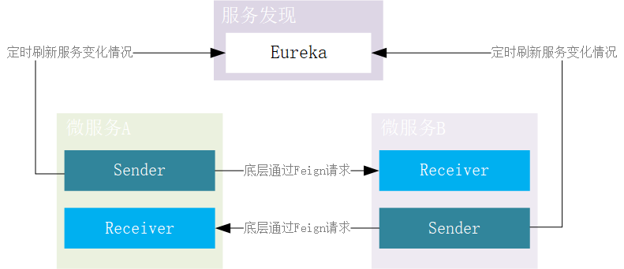
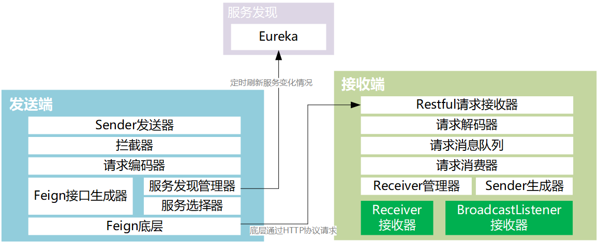

## 1 Background

An HTTP interface between Feign-based microservices can only satisfy a simple microservices instance of a random selection of a service instance of a microservice under simple rules that cannot be achieved if you want asynchronous messages to the caller.

At the same time, since Feigns only support simple service selection rules, it is not possible to forward requests to the specified microservice instance and do not allow all instances in which a request is broadcast to the recipient microservice.


## 2 Introduction

Linkis has implemented its own base RPC communication program based on Feign.

Linkis RPC, as the bottom communication programme, will provide SDK to be integrated into needed microservices.

A microservice can be both the caller and the recipient of the request.

When serving as the caller, Receiver, through Sender, requests for the microservices of the target receiver, and as the requesting recipient, will provide Receiver, which will be used to handle requests sent by the requesting receiver Sender, in order to complete synchronized or asynchronous responses.




## 3 Implementation

The Sender system based on the requesting party and the Receiver system of the requesting party form the whole structure of the Linkis RPC.



### 3.1 Sender

Linkis RPC, as the bottom layer of communication, does not require the sender to write any actual code.

- 1) Users obtain a Sender sender by calling SDK provided by Linkis RPC, either through a microservice name (Service Name) or a designated microservice instance (Microservice Name + Microservice Instances IPs and Ports).

 &ensp; &ensp; &ensp; &ensp; Sender提供的可使用方法，见如下伪代码：

```java
abstract class Sender 56
    Object ask (Oject message);
    Object ask (Oject message, Duration time);
    void send(Object message);
    void delivery (Oject message);
}
```

 &ensp; &ensp; &ensp; &ensp;where:

        The ask method is the synchronous request response method;
        2. Sendmethod is the synchronous request method, only responsible for synchronizing sending requests to the receiving end and not requesting a response from the receiving end;
        3. delivery is the asynchronous request method, as long as the sending end's process does not exit, the request will be sent to the receiving end later through other threads.

- 2) Users send requests to the receiving end through the request method provided by the Sender sender as the sending end.

- 3) Sender sender will pass the user's request to the blocker.拦截器拦截请求，开始对请求做额外的功能性处理：

     a) Radio interceptors.

     Broadcast interceptors will only be effective for requests requiring broadcasting.

     The broadcast interceptor will provide a special broadcast interface, and if the request is implemented and the request is not being broadcast, the broadcast interceptor considers that the request needs to be broadcast, which will trigger the broadcasting operation.

     The specific steps are：to get all microservices instances that request to broadcast. If empty, broadcast by default to the microservice; then mark the request as being in the broadcast, call step 1), get all Senders of all microservice instances that correspond to them, start sending the request by multi-thread; and wait until Sender in the threaded pool sends a request and mark this broadcast request as successful, return to the user and complete it.

     b) Retry the interceptor.

     Retry the blocker will provide a retry feature for all next steps.

     If the sender has successfully sent the request, but the receiving party returns an exception requesting a retry, which triggers a retry of the interceptor and automatically resubmit the request; if there is no specific instance of the microservice receiver, there will be a connection exception (connection exception) at the time the request is sent; or if the user has specified certain exceptions that need to be retrated, the interceptor will be automatically retrated.

     c) Cache blockers.

     The cache blocker is set to respond to synchronized requests that are unlikely to change frequently.

     The cache interceptor will also provide a special cache interface, and if this request is implemented, will first find in the cache interceptor whether the request has cached the response of the receiving end or, if there is it, return the cache response directly, continue the next step down and, if the response is returned on the receiving end will first be cached and the response will be returned to the user for processing.

     d) Default interceptor.

     The default blocker is used to call the next handling.

     e) Custom interceptors.Users can also implement their own custom interceptors to perform some specific features.

- 4) The request encoder will convert the data requested by the user (Entity Bean) into a serialized JSON string and then pass to the Feign's client generator.


- 5) Feig client generator to generate a Feign client that can access the Recipient Restful request receiver.


- 6) The generated Feigne client will call the service discovery manager, get all the microservice lists, use the service selector, and use the service selector if the user is a microservice name in step 1, then request forward for a request to select a suitable recipient microservice instance or rewrite the FeignLoadBalancer (Fign Load Balancer) for Spring Cloud Fox and assign the corresponding microservice instance as step 1 when creating the LoadBalancerCommand).


- 7) Call Feign's client to start requesting Restful request receiver at the receiving end.


### 3.2 Recipient

 Receiver-interface needs users to implement to handle real business logic.

1) Restful request receiver as the HTTP web service embedded in Linkis RPC, responsible for receiving requests from the sending side

2) Restful's request receiver receives the request by calling the request decoder to decode the request, parse the actual request message and send the microservice information (microservice name+Microservice instance IP and port) and, if the resolution fails, respond directly to the parsing request.

3) Put parsed requests and outgoing microservice messages in the request message queue;

4) Consumer's request will consume the request message queue, already decode the sender’s request.

 Get a suitable Receive by calling a Receiver; and generate a Sender to send end using the Sender generator by retrieving the Sender microservice information received.The consumer is then requested to pass the actual request information and the generated Sender, to Receiver, for processing;

5) Receiver, as the actual processing module for user requests, requires the user to implement the Receiver interface and complete the practical processing logic of the call end request.

 Receiver's pseudo-code below：

```java
Public interface Receiver {
    void receive(Object message, Sender senter);
    Object receiveAndReply (Oject message, Sender senter);
    Object receiveAndReply (Oject message, Duration duration, Sender senter);
}
```

 Receiver provides a way to process synchronized and asynchronous requests.

6) If this request is an asynchronous request, the Receiver's receiving method is called and it is up to the top level of business to decide whether a response is required through the Sender of the sending end.

7) If this request is sync, call Receiver's receiveAndReply, return value as a response and send it back.
