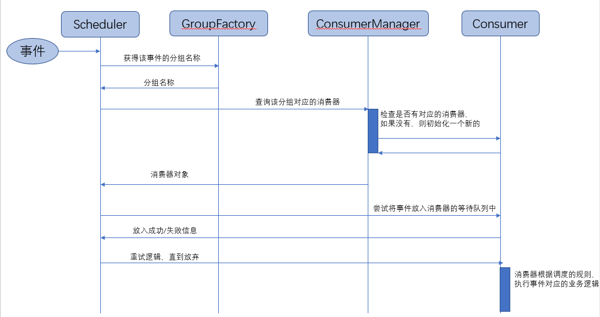

> Linkis Scheduler - Smart Monitor Expansion Cost Architecture

## 1 Background

Under the microservice architecture, each service handles only one logic, and calls between services are made to achieve asynchronous and coupled, often in the form of submission of events and distribution of consumption by the end of the service.

This makes the distribution of events subject to a large number of different types of events that have different requirements in terms of emergency, anticipated implementation time, relinquishment, and the large and unpredictable gap between peak and low valley arrivals. Data structures and algorithms, such as traditional consumption queues, cannot meet the requirements and a new distributive consumption algorithm that reasonably classifies events and allows for timely monitoring of consumption patterns, expansion and adjustment of consumption processes.

## 2 Ideas

1. By clustering all objects in the group correspond to a full life cycle.

2. Each group can independently set the parameters for measuring consumer health, with separate threaded monitoring and adjusting them to the defined logic, ensuring to the greatest extent possible the stable functioning of the consumer when found unhealthy.

2. In each cluster, a combination of associated parameters is defined, and when a parameter is adjusted, all the parameters associated with it are adjusted to keep the consumer functioning as far as possible.

## 3 Implementation

As shown in the graph below, the process by which Linkis Scheduler distributes consumer events is as follows：

### 3.1 Specific achievement

1. When the parties arrive, the dispatcher requested the group factory and obtained the name of the group that the event should have access.

   The role of the cluster plant is to parse the attributes of the event and associate it to a subgroup, the logic being left to the developer of the specific consumer to inherit it it it itself, as long as the unifying interface of the GroupFactory provided by the programme is implemented.

2. When the group name is obtained from the group factory, the scheduler requests the consumer manager to obtain the actual consumer for the group.

   The consumer manager is the only global one that maintains a subset to consumer mapping relationship and is responsible for initialization of the consumer at the time of the first request.

   In the process of initializing the consumer, the consumer manager creates a consumer object and then identifies from all Group entities the corresponding one by name, sets the parameters in it to the newly created consumer object, and starts the consumer to get it into the working state and dispose of it.

3. The scheduler puts the event in the waiting queue of the corresponding consumer.

   Each consumer maintains a waiting queue and an executive queue.

   After each `distribution interval' parameter specifies, the consumer checks if there is an empty position in the executive queue or the position of an event that has been executed. If so, select an event from the waiting list, place it into the position and start executing the event (the logic of the event depends on the distribution rules, such as the default FIFO rules select the first queued events).

### 3.2 Parameter adjustment

This option needs to go through the following process： when adjusting the parameter

1. Request group factory, get the group object by name to be adjusted. Set the parameter directly in Consumer is not supported.

   This subgroup can be adjusted only if the parameters of the adjustment method are publicly available.

2.  Try setting the parameter by calling the reference method in the group object.涉及以下两种情况：

    a) Parameters must be limited within the limits set by several groups of numbers.
   
        Feedback settings failed if the set parameter is not within range.
       
        If within the permitted range, the group of objects will get the corresponding consumer through the consumer manager, setting the target parameter to the target value, and setting the other parameters with the matching number as the value.

    b) Parameters must be proportional to the limit.
   
        The subset of objects receives the consumer through the consumer manager, setting the target parameter to the target value, while also calculating the target value pro rata and re-setting all other parameters.

In addition to manual setting of parameters, each consumer has an independent control thread to measure the length of waiting queue in the consumer, the number of events being implemented and the proportion of time spent growing.

In each cluster object, thresholds and warning rates are set for these indicators, and once an indicator exceeds the threshold, the ratio between or more indicators exceeds the restricted range (e.g. monitoring to the average implementation time is greater than the distribution interval parameter, which is considered to exceed the threshold), the control thread is immediately extended to consumers.

When extended, the above reference process is fully utilized, with a specific parameter being targeted and other parameters automatically extended.
