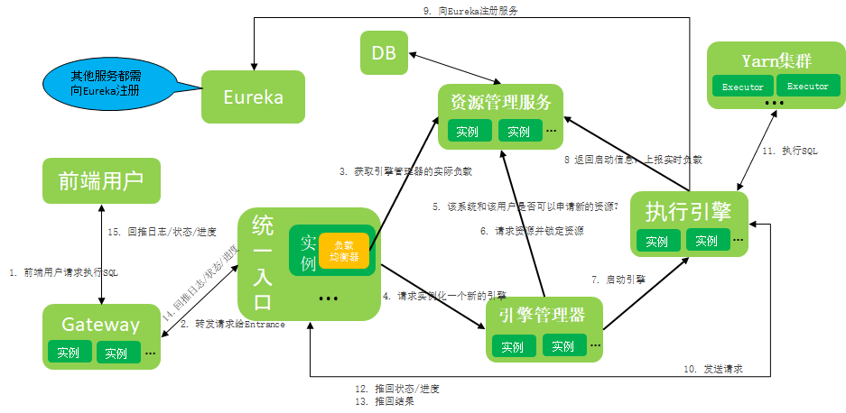
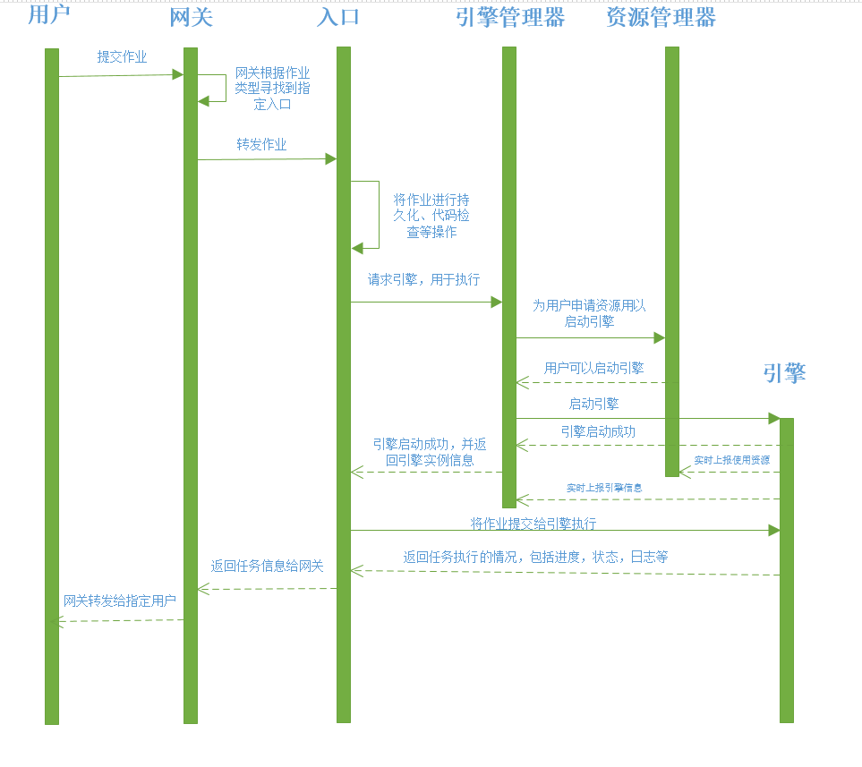

 ## 1 Linkis design leader

 Virtually every component of large data open source ecosphere has its own set of user permissions management, resource management, metadata management, independent API access and usage.

 And new components are emerging.

 However, user business needs often require multiple open source components to be addressed in tandem.

 For a business demand, users need to learn manuals for the use of multiple products and duplicate customized development on more than one product in order to truly introduce open source components into the actual production environment.

 This has resulted in extremely high learning costs and additional workload for users, and significant duplication of maintenance management is required in the area of transportation.

 At the same time, the upper tier functional tool products and the bottom computing storage system are too coupled, hierarchical structure and call-in relationships are not clear enough to reconcile couples, leading to any change in the bottom environment that directly affects the normal use of business products.

 How to provide a single set of data intermediaries, block all calls and usage details from the bottom to the upper, so that business users can really focus only on the details of the business, even if the extension of the base large data platform room and overall relocation are not affected, the original intent of Linkis!

## 2 Linkis Technical Architecture

 

As shown in the graph above, based on the currently popular SpringCloud microservice technology, we have created multiple microservice clusters to provide high-availability capabilities.

Each microservice cluster assumes a part of the functional responsibilities of the system and is clearly delineated as follows.e.g.：

- **Unified Jobs Execution Service**：A distributed REST/WebSocket service to receive various scripts requests from users.

  **Currently supported computing engines have**：Spark, Python, TiSpark, Hive and Shell.

  **Supported script languages include**：SparkSQL, Spark Scala, Pyspark, R, Python, HQL and Shell;

  For more information on the uniform job execution service, see[UJES schema design document](ujes/ujes_design.md)

- **Resource management service**： supports real-time control of resource use by each system and user, limits resource usage and confluence of systems and users, and provides real-time resource dynamics graphs to facilitate access to and management of system and user resources;

  **Currently supported resource types**：Yarn queue resources, servers (CPU and memory), number of concurrent users etc.

  For more information about the resource management service, see[RM Design Document](rm.md)

- ~~**Application management service (open source version is not available)**：manages all user applications across all systems, including bulk offline applications, interactive querying applications and real-time streaming applications, providing powerful reuse capabilities for offline and interactive applications and providing applications throughout the life cycle management, automatically releasing redundant user idle applications!

- **Unified storage service**：Universal IO, capable of fast interfacing various storage systems, providing a uniform call entry, supporting all commonly used formats, having a high degree of integration, simple usage;

 For more information about the Unified Storage Service, see[Storage架构设计文档]

- **Unified context service**：Unify user and system resource files (JAR, ZIP, Properties, etc.), users and systems, computing engine parameters and variable management in one setting, automatic reference;

- **Library**：Systems and user level material management, sharing and flowing, support automatic life-cycle management;

- **Metadata service**：Real-time Table Structure and Partition Show.

Based on the interaction of these microservices, a centralized, unified large data platform service will be built outside.

Through the construction of these services, we have improved the way and process of external service across the large data platform.

## Linkis Business Architecture

Name Explanation：

**1) Gateway gateway:**

 Plugins are enhanced based on Spring Cloud Gateway and a new WebSocket multi-capacity gateway service is added, mainly for parsing and routing user requests to specified microservices.

**2) Unified entry:**

 Unified entry is a job life cycle manager for a class of engines.

 From job generation to submission to execution engine, to job feedback to users and operations closed, Entrance manages the entire life cycle of an operation.

**3) Engine manager:**

 Engine managers manage the engine throughout its life cycle.

 It is responsible for requesting and locking resources from the resource management service and for instantiating new engines, as well as monitoring the life state of the engine.

**4) Execution Engine:**

 The execution engine is a microservice that truly executes user assignments. It is started by the engine manager.

 In order to improve interaction, the engine service is to interact directly with the uniform entry that is submitted to its operation, to correctly execute the job and to provide feedback on user needs such as logs, progress, status and resultsets.

**5) Resource management services**

 Real-time controls the use of resources per system and per user, the management of the use and actual load of microservice clusters and limits the use and concomitant use of resources by systems and users.

**6) Eureka**

 Eureka is the service discovery framework developed by Netflix, and SpringCloud is integrated into its subproject spring-cloud-netflix to achieve SpringCloud service discovery features.

 Eureka Client is built into each microservice and has access to Eureka Server and ability to find service in real time.

## 4 Linkis Processes

Below is a description of how users have submitted a SQL, Linkis to be executed and returned to the results in the upper tier system.

1. Users of the upper system submit a SQL, first passing through Gateway, Gateway, which resolves user requests and routes them to the appropriate Unified Entry Entrance

2. The entry will first look for whether the user of the system has the available Spark engine service and, if so, will submit the request directly to the Spark Engine Service

3. No Spark Engine service available, start finding features via Eureka service registration, get a list of all engine managers and get the actual load of engine managers by requesting RM in real time

4. Entrance gets the lowest payload engine manager, starting to require the engine manager to start a Spark engine service

5. The Engine Manager received a request and started asking the user under RM if the new engine could be started

6. Start requesting resources and locking if you can start; otherwise return the failed exception gives Entrance

7. Successfully locked the resource. Start the new spark engine service; return the new Spark engine to Entrance after successful startup

8. When Entrance gets a new engine, start requesting SQL execution from the new engine

9. Spark new engine received SQL requests, started submitting SQL to Yarn, and sent logs, progress and status to Entrance in real time

10. Entrance delivers logs, progress and status to Gateway in real time

11. Gateway Back Logs, Progress, and Status to Frontend

12. Once SQL has been successfully executed, Engineering has taken the initiative to push the results set to Entrance, Entrance notifies the frontend to obtain the results.

For design options in the case of Entrance/EngineManager/Engineering, see[UJES Architecture Design Document](ujes/ujes_design.md)