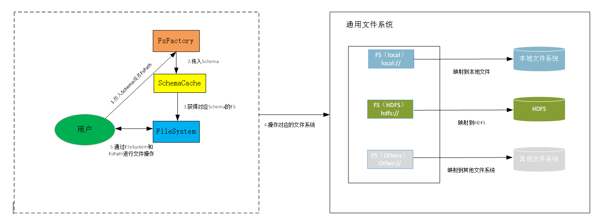

> How to manage multiple filesystems

## 1 Background

Many systems face the need to access many document systems.Using local and HDFS filesystems, for example, users need to know Java SDK for both filesystems and have significant learning costs.

Also when using its Java SDK, instantiating FileSystem requires a lot of configuration information to be passed into and initialized, increasing the complexity of user use.

Can you read the file by automatically allowing the file system to automatically identify and switch to the bottom file system by specifying the schema header of the path?

## 2 Ideas

提供通用的文件系统Java SDK，用户通过调用FSFactory创建FileSystem，使用通用接口进行多种文件系统的访问，整体方案如下图：

## 3 Implementation

**(1)** Users get a Fs via FS Factory, FsPath. FsPath instantiates different filesystem types by schema, such as local:// tmp/test.txt and hdfs://tmp/test.txt,FsFactory can access FileSystem objects by schema headers (e.g.：local or hdfs);

**(2)** FileSystem object, providing universal interfaces such as：getting file size and creating, deleting files (folders), reading and writing files. The user needs only to call the method inside the FileSystem object to complete the corresponding filesystem.

**(3)** Users can operate the corresponding filesystem via FileSystem and incoming to the corresponding FsPath. Generic filesystem operations can be implemented through the second point of operation.

**(4)** FileSystems, which corresponds to actual filesystem objects and interfaces, are blocked for users and can operate different filesystems at the bottom once they know the interface and methods of FileSystems. If the user needs to read the local file local:// tmp/test.tx, the user can simply call the FileSystem's reader method to read and extract the contents from the file input stream of the local file system. The File System (File System) interface has now implemented local LoaclFileSystem and HDFSFileSystems. Users can easily extend access to different filesystems by implementing the File System (File System) interface.