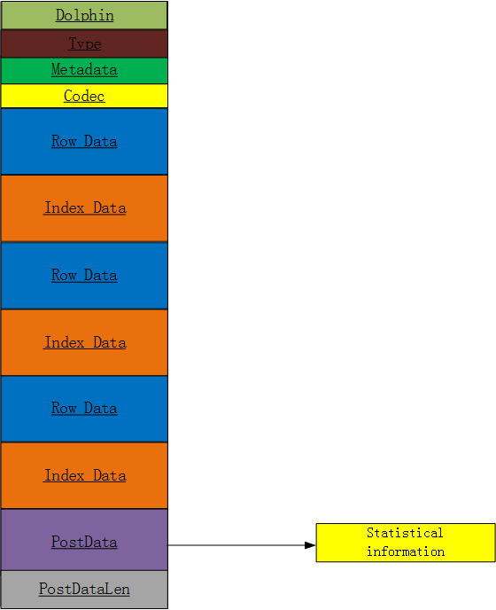

> Result collection file storage scheme - Dolphin file

## 1 Background

Linkis faces the need to store multiple types of data into the file, such as：store the Hive Table data into the file and want to save metadata such as types, listings and comments in the field.

Existing file storage schemes generally only support specific data types such as：ORC supports data tables but does not support unstructured data saving.

At the same time, support for saving special characters has also prompted us to define the new file format.If a field has special characters such as a newliner in：textFile, parsing the content will cause an anomaly.

Finally, if the file is too large, Linkis usually wants to provide page-splitting, the existing file storage scheme supports only how many bytes, not how many lines to skip or read only one line of the file.

## 2 Ideas

Linkis defines a Dolphin file format that stores multiple data types.

Dolphin's file structure is shown above in graph：

- The Dolphin logo is stored at the beginning of the file to distinguish if the file is Dolphin

- Metadata：内容元数据信息

- Index Data: Line long index

- RowData: RowData.

 RowData stores a row of data such as：stores data from a row of the table, including the length of the row and Byte data of the row.

- PostData: File Basic Information

- PostDataLen：basic information length

where PostDatais is the primary message of the file by：

- Type：store content

- Codec：encoding format

- Statistical information：file content statistics include rows, max, etc.

## 3 Implementation

Dolphin文件的读入和写入的具体流程如下图：

### 3.1 Data written in Dolphin

The user needs to store a file content (e.g.：table) into Dolphin as follows：

Writing Dolphin file identifier

Type of data written

By Serializer, write to Metadata (metadata) such as table listing, type per column, annotation, etc.;

4 Incoming data to Dolphin Writer and Dolphin Writer by Serializer serializer to Dolphin by serializer

5. Update statistical information after writing this row data, add rows, update the minimum values per column, etc.;

6, DolphinWriter writes statistical information, encoding information, etc. PostData(basic information) to Dolphin files;

7, length of writing to PostData. Finish writing action.

### 3.2 Reading Dolphin

User read Dolphin file content step below：

1. read Dolphin file identifier and drop anomalies if not Dolphin;

2. If users only need to read statistical information, read PostData's length and get PostDatadata based on that length.

 By PostData, parse basic information to the corresponding Type, Codec, MetaData, Statistical information.

 Returned, complete this reading operation.

If the user wishes to read the data, then the type of data will be read first.

Reads Metadata messages, fetches the deserializer via Type, and encapsulates the read Bytes data into MetaData

Reading the curtain index and reading the lines Bytes through the curtain index.Gets the deserializer via Type, convert Bytes to Records, encapsulate Recording RowData with MetaData;

6. Complete reading by giving the read RowDataline content to the user.

### 3.3 Reading

**Question**：How to read a line?How many lines to start read?

**Answer**： will first write the cursor index when writing in a line, so that users can index and jump to read when reading;

### 3.4 Serialization

Serializer will serialize data into byte arrays, deserializer will parse byte arrays as strings to achieve proper reading of special characters;

Serializer (Serializer) and Deserializer (Deserializer) are associated with type (Type), and different data types can define different Serializers and Deserializers.

Dolphin provides a common interface to support other types of files with user customization.