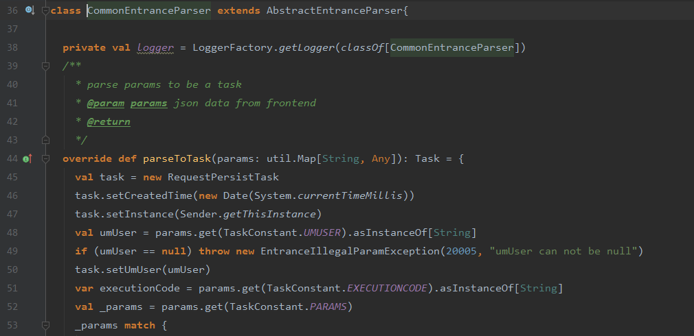
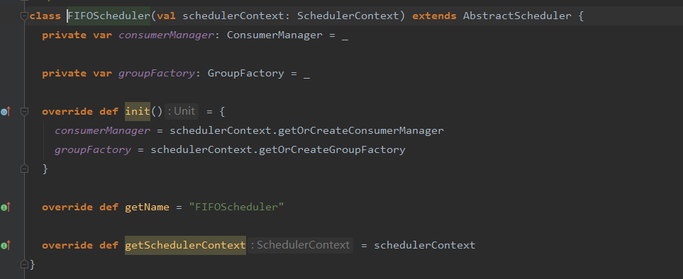
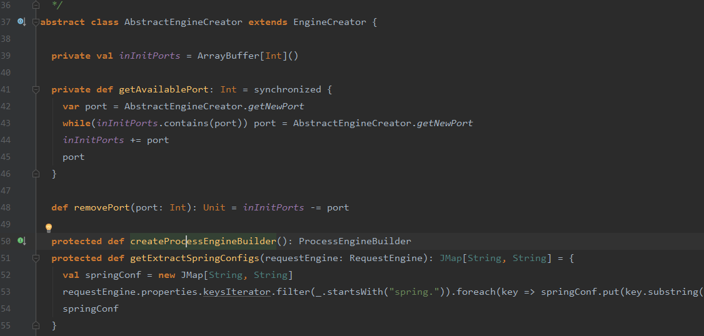
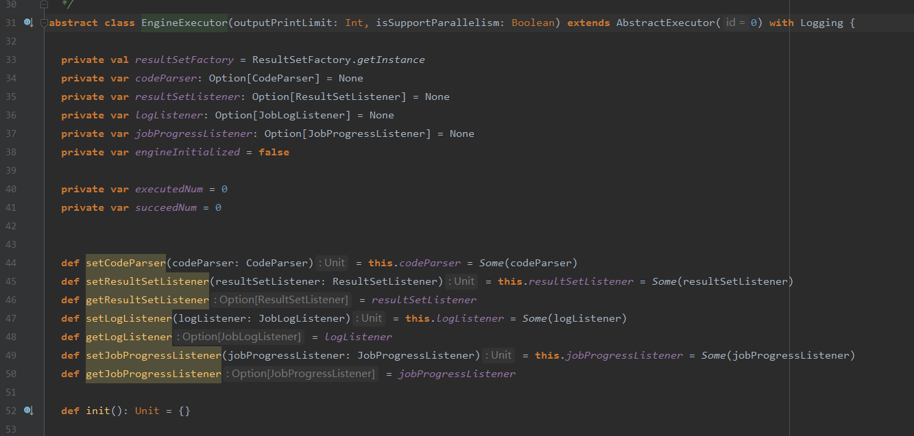
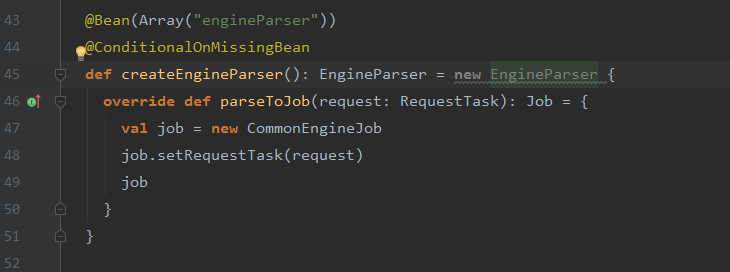
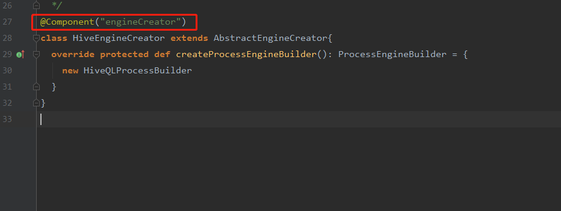
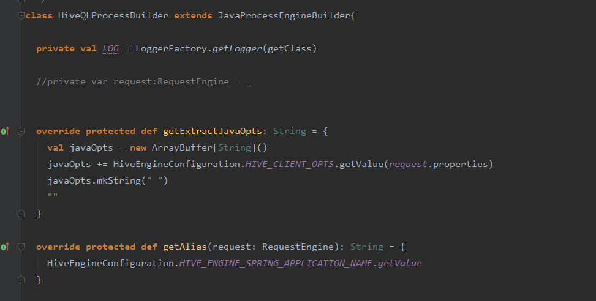
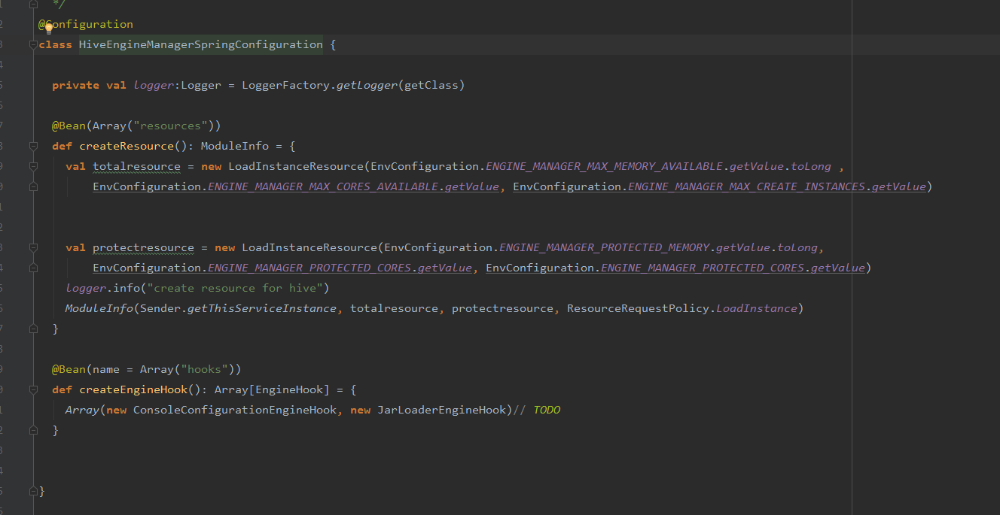
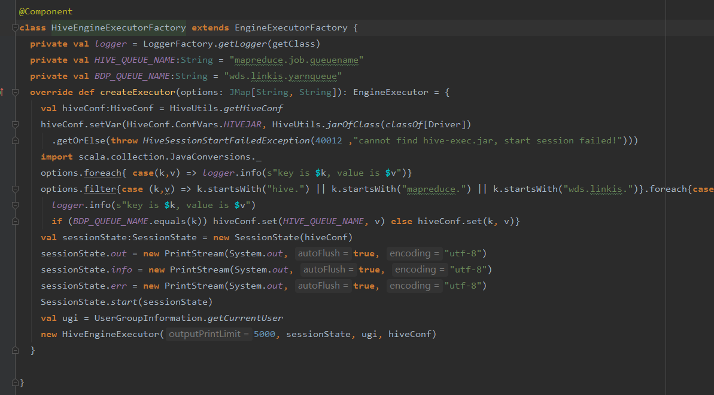
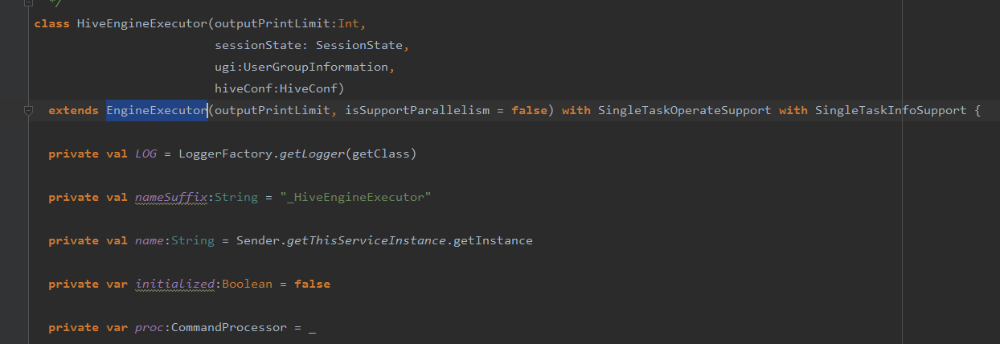

## 1 General introduction

&nbsp;&nbsp;&nbsp;&nbsp;&nbsp;&nbsp;&nbsp;&nbsp;When using Linkis, developers can use not only the implementation engine developed by Linkis, but also develop their own applications based on their own needs.

&nbsp;&nbsp;&nbsp;&nbsp;&nbsp;&nbsp;&nbsp;&nbsp;Linkis can be abstractly divided into Entrance, Engineer and Engineer modules, in which the roles and structures of the three modules Entrance, EngineManager and Engineer can view the UJES Architecture Design Document.

&nbsp;&nbsp;&nbsp;&nbsp;&nbsp;&nbsp;&nbsp;&nbsp;Users can implement one of their Linkis engine only if they have the necessary interfaces for three modules.

## 2 Access Actions

### 2.1 Entrance

#### 2.1.1 Maven Dependencies

```xml
<dependency>
  <groupId>com.webank.wedatasphere.linkis</groupId>
  <artifactId>linkis-ujes-entry</artifactId>
  <version>0.5.0</version>
</dependency>
```

#### 2.1.2 Interfaces to be implemented

 Entrance没有必须要实例化的接口，以下接口可以根据需要进行实现：

- EntranceParser.A request for frontend passing, usually Json, is converted to a permanent Task.The class already provides AbstractEntraceParser. The user needs to implement the parseToTask method. The system default provides CommonEntranceParser implementation.

 <br/>

- EngineQuester.Used to obtain a Request Engineering class that requests a new Engineering from EngineManager's Microservice.Linkis already has an implementation class.

 <br/>

- Schedule.To implement the schedule, multiple user combinations have been implemented by default and FIFO execution within a single user.

 <br/>

### 2.2 Engineer's Access

#### 2.2.1 Maven dependency

```xml
<dependency>
  <groupId>com.webank.wedatasphere.linkis</groupId>
  <artifactId>linkis-ujes-enginemanager</artifactId>
  <version>0.5.0</version>
</dependency>
```

#### 2.2.2 Interfaces to be implemented

 EngineManager needs to implement the following interfaces as needed:

- EngineCreator, already exists in AbstractEngineCreator, needs to implement the CreateProcessor method to create a Builder.

 &nbsp;&nbsp;&nbsp;&nbsp;&nbsp;&nbsp;&nbsp;&nbsp;Here ProcessEngineer has provided a JavaProcessEngineering Builder class by default. This class is an abstract class, which will have enabled the required classpath, JavaOpts, GC file paths, log file paths and the start of DEBUG port in test mode.

 &nbsp;&nbsp;&nbsp;&nbsp;&nbsp;&nbsp;&nbsp;&nbsp;JavaProcessEngineer now, just add additional classpath and JavaOpts.

 <br/>

- EngineresourceFactory, already exists in AbstractEngineResourceFactory, needs to implement the getRequestResource Method to get customized resource requests from users.

 <br/>

- hooks, this is a spring entity bean, mainly used to create and start the engineering, front and back hook, requiring an Array[EngineHook]from the user for dependency injection.

 <br/>

 &nbsp;&nbsp;&nbsp;&nbsp;&nbsp;&nbsp;&nbsp;&nbsp;For practical examples, see Hive EngineManager.

- Resources, which is a spring entity bean, mainly used to register resources like RMM, resources are an example of ModuleInfo, which needs to be provided by the user for an injection.

 <br/>


### 2.3 Engine's Access

#### 2.3.1 Maven dependency

```xml
<dependency>
  <groupId>com.webank.wedatasphere.linkis</groupId>
  <artifactId>Linkis-ujes-engine</artifactId>
  <version>0.5.0</version>
</dependency>
```

#### 2.3.2 Interfaces to be implemented

1. The following interfaces that Engineering must implement are：

- EngineecutorFactory.Used to create an Engineecutor that needs to implement the createExecutor method, specifically creating an Engineecutor through a Save Parameter.

<br/>

- Engineecutor.The actual executor is used to submit the code submitted by the execution.Need to implement getActualUsedResources, which is actually used by this engine, executeLine, which executes the code parsed through CodeParser), executeCompletely (executeLine's supplementary method, when executeLine's return is ExecuteIncomplete, new code and code returned to ExecuteIncomplete will be passed to engine execution)

<br/>


2. Engineers are not required to implement interfaces or bean as follows:

- engineHooks: Array[EngineHook]is a spring bean.EngineHook is the front and back hook created by engine, and the system now provides 2 hook：CodeGenerator Hook to load UDF and functions, ReleaseHook to free idle engine, and if unspecified the system will provide engineHooks=Array (ReleaseEngineHook)

<br/>

- CodeParser.Used to parse code for line execution.If not specified, the system provides a CodeParser that returns all code directly.

<br/>

- EngineParser to convert a RequestTask to Job that can be submitted to Scheduler. If not specified, the system will provide an Engineer, which will convert RequestTask to CommEngineJob.

<br/>


## 3 Reference instances

&nbsp;&nbsp;&nbsp;&nbsp;&nbsp;&nbsp;&nbsp;&nbsp;This section will provide a reference example by presenting the preparation of the Hive engine.

### 3.1 HiveEntrance Access

&nbsp;&nbsp;&nbsp;&nbsp;&nbsp;&nbsp;&nbsp;&nbsp;According to the description in section II, Entrance has no interfaces that need to be implemented, the code in linkis-0.5.0 and the concentration of hive has only two categories, which are used for error code expansion.

### HiveEngineManager's Access

- Implementation of the Engineering Creator interface

<br/>

&nbsp;&nbsp;&nbsp;&nbsp;&nbsp;&nbsp;&nbsp;&nbsp;From the above diagram, we can see that there is a HiveEngineering Creator class in the HiveEM module, inherited the AbstractEngineCreator class, and implemented the createProcessor method, returning to a HiveQLProcessBuilder.

- 2.HiveQLProcesbuilder implementation

&nbsp;&nbsp;&nbsp;&nbsp;&nbsp;&nbsp;&nbsp;&nbsp;The HiveEngineManager module has a HiveQLProcessBuilder class inherited from the Java ProcessBuilder, which implements a number of required interfaces and overwrites the build method. The parent build method is adequate and the HiveQLProcessBuilder version method is designed to get the user imputed parameters and is then added to the launch command.

<br/>

- AbstractEngineering Interface Implementation

<br/>

&nbsp;&nbsp;&nbsp;&nbsp;&nbsp;&nbsp;&nbsp;&nbsp;In this instance we can notify resource managers of CPU counts, memory size, number of instances that users want to get every time they request an engine.

- Injection of 4.resources and hooks bean

<br/>

&nbsp;&nbsp;&nbsp;&nbsp;&nbsp;&nbsp;&nbsp;&nbsp;As we can see from the above figure, by injecting a Spring's configuration to configure resources and hooks, the UJES framework itself will provide @ConditionalMissingingBean annotation injected into the default bean, and developers can inject their own entity bean according to their needs.In this class of instance bean, the user can register the total memory of the Engineer's service, total CPU count, total number of cases available to them in RM

### 3.3 HiveEngine Access

- EngineExecutorFactory Interface Implementation

&nbsp;&nbsp;&nbsp;&nbsp;&nbsp;&nbsp;&nbsp;&nbsp;The HiveEngineering module included a HiveEngineExecutorFactory, which returned to HiveEngineExecutor at the end of the createExecutor methodology.

<br/>

- EngineExecutor Interface Implementation

&nbsp;&nbsp;&nbsp;&nbsp;&nbsp;&nbsp;&nbsp;&nbsp;The executeLine is an interface that must be implemented by passing into a script, separated by CodeParser, returning to ExecuteResponse (successful or failed).

<br/>

&nbsp;&nbsp;&nbsp;&nbsp;&nbsp;&nbsp;&nbsp;&nbsp;In addition, executeCompletely, which was called back to IncompleteReponse at executeLine.

&nbsp;&nbsp;&nbsp;&nbsp;&nbsp;&nbsp;&nbsp;&nbsp;When it executes its operations, there are other commonly used methods, such as close kill pause progress, which can be achieved according to its own needs.

## 4 FAQ

&nbsp;&nbsp;&nbsp;&nbsp;&nbsp;&nbsp;&nbsp;&nbsp;Ask questions to be asked.

<br/>