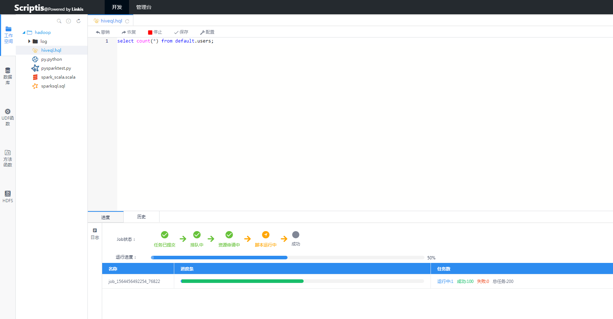
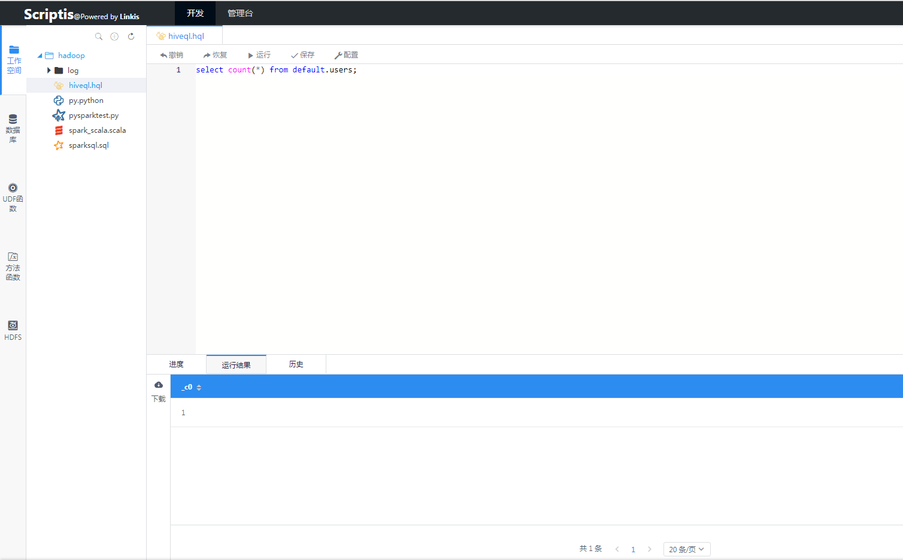

## 1 Hive Engine Use
&nbsp;&nbsp;&nbsp;&nbsp;&nbsp;&nbsp;&nbsp;&nbsp;The Hive implementation engine implemented by Linkis now supports HiveQL submissions and users can submit their own HiveQL to the cluster where they submit their own HiveQL via Linkis using the three interface modes of the document (SDK, HTTP, WebSocket).

&nbsp;&nbsp;&nbsp;&nbsp;&nbsp;&nbsp;&nbsp;&nbsp;To implement the HiveQL program using Linkis, you need to download the Linkis's release package and configure, install and start the specified microservices.

### Environment Variable Configuration

&nbsp;&nbsp;&nbsp;&nbsp;&nbsp;&nbsp;&nbsp;&nbsp;Environment variables on which the Hive engine depends: HADOOP_HOME, HADOOP_CONF_DIR, HIVE_HOME, and HIVE_CONF_DIR.

&nbsp;&nbsp;&nbsp;&nbsp;&nbsp;&nbsp;&nbsp;&nbsp;Before starting the microservice associated with the Hive execution engine, make sure that the above environment variables are set up, if not, in the linkis.properties configuration file in /home/${USER}/.bash_rc or linkis-ujes-spark-enginemanager/conf.As shown below

```properties
  HADOOP_HOME=${真实的hadoop安装目录}
  HADOOP_CONF_DIR=${真实的hadoop配置目录}
  HIVE_CONF_DIR=${真实的hive配置目录}
  HIVE_HOME=${真实的hive安装目录 }
```

### 1.2 Dependency service activation

Launch of the Hive engine, depends on the following Linkis microservices:

- 1), Eureka: for service registration for discovery.
- 2), Linkis-gateway: for user request forwarding.
- 3), Linkis-publicService: provision of basic functions such as persistence, udf and more.
- 4), Linkis-ResourceManager: Provides Linkis Resource Management features.

### 1.3 Custom Parameter Configuration

&nbsp;&nbsp;&nbsp;&nbsp;&nbsp;&nbsp;&nbsp;&nbsp;You also need to start HiveEntrance and HiveEngineManager when using hive.

&nbsp;&nbsp;&nbsp;&nbsp;&nbsp;&nbsp;&nbsp;&nbsp;HiveEntrance is the recipient of the Hive operation and the HiveEngineer is the initiator of the HiveEngine.

&nbsp;&nbsp;&nbsp;&nbsp;&nbsp;&nbsp;&nbsp;&nbsp;Before starting, users can set custom parameters for the hive engine.

&nbsp;&nbsp;&nbsp;&nbsp;&nbsp;&nbsp;&nbsp;&nbsp;Linkis, taking into account the user desire to be freer to set the parameters, provides many configuration parameters.

&nbsp;&nbsp;&nbsp;&nbsp;&nbsp;&nbsp;&nbsp;&nbsp;The following table contains some commonly used parameters. The Hive Engine supports the configuration of more parameters to achieve better performance, such as you have the best needs and welcome to read the pamphlets.

&nbsp;&nbsp;&nbsp;&nbsp;&nbsp;&nbsp;&nbsp;&nbsp;Users can configure these parameters in linkis.properties.

| Parameter Name                                | Ref Value | Note                                                                     |
| --------------------------------------------- | --------- | ------------------------------------------------------------------------ |
| wds.linkis.enginemanager.memori.max           | 40G       | Total memory used to specify clients for all hiveEM-started engines      |
| wds.linkis.enginemanager.cores.max            | 20        | Total CPU nucleus used to specify clients for all hiveEM-started engines |
| wds.linkis.enginemanager.engine.instances.max | 10        | Specify the number of engines hiveEM can start                           |

### 1.4 Frontend deployment

&nbsp;&nbsp;&nbsp;&nbsp;&nbsp;&nbsp;&nbsp;&nbsp;After the microservice launch started successfully, users need to submit their HiveQL code via a webbrowser.可以通过部署配置微众另一款开源的前端产品[Scriptis](https://github.com/WeBankFinTech/Scriptis/blob/master/docs/zh_CN/ch1/%E5%89%8D%E5%8F%B0%E9%83%A8%E7%BD%B2%E6%96%87%E6%A1%A3.md)，该产品让用户能在web页面上编辑、提交代码，并能够实时接收后台给的信息。

**1.5 Run Effect Graph**

<br/> Figure 1 Operation effect figure 1

<br/> Figure 2

## 2 Hive Engine Implementation Method

&nbsp;&nbsp;&nbsp;&nbsp;&nbsp;&nbsp;&nbsp;&nbsp;The implementation of the Hive execution engine is the necessary interface for the three modules Entrance, Engineer and Engineer in the context of the Linkis development documents, of which the Engineering Module is the most special and the Hive method of delivery has its own logic.

&nbsp;&nbsp;&nbsp;&nbsp;&nbsp;&nbsp;&nbsp;&nbsp;Linkis now providing version of Release, based on version 2.7.2, and version 1.2.1, both of which is apache.

&nbsp;&nbsp;&nbsp;&nbsp;&nbsp;&nbsp;&nbsp;&nbsp;Linkis's Hive engine interacts with bottom hive mainly through the HiveEngineExecutor class, which is instantiated by HiveEngineExecutorFactory, the bean.

&nbsp;&nbsp;&nbsp;&nbsp;&nbsp;&nbsp;&nbsp;&nbsp;In the executeLine interface implemented by HiveEngineecutor, Linkis passing through the CommandProcessorFactory class in use by Hive is provided with configuration information on local hive, obtained a org.apache.hadoop.hive.ql.Driver, and the Driver class provides the API to help submit user scripts code to be executed in the cluster.

&nbsp;&nbsp;&nbsp;&nbsp;&nbsp;&nbsp;&nbsp;&nbsp;After submitting the hive sql code, Driver has an API that provides whether the execution is successful and if you get the results set.If executed successfully, use the Unified Storage Service provided by Linkis, store the results set in the specified directory for user viewing.

&nbsp;&nbsp;&nbsp;&nbsp;&nbsp;&nbsp;&nbsp;&nbsp;Moreover, after submitting the hive sql, if the map mission is created, we can also kill the already submitted Hive Query mission via the API, provided by HadoopJobExecuecHelper, which is the logic of the user front kill.<br/>

&nbsp;&nbsp;&nbsp;&nbsp;&nbsp;&nbsp;&nbsp;&nbsp;On another point, the Linkis hive engine also performs progress features.In particular, through the runningJobs field of HadoopJobExecHelper to get the running MR tasks, which then have the corresponding map and reduction progress, making them a mathematical calculation, and bearing in mind that runningJobs are operational MR jobs that will be removed from the List, so that the sql implementation plan will need to be obtained at the outset and can be seen in the implementation of the code.

## 3 Fit your own hive version
&nbsp;&nbsp;&nbsp;&nbsp;&nbsp;&nbsp;&nbsp;&nbsp;Since the current version of Linkis is an apache version that supports 1.2.1, the clusters of many users may not be consistent with our companies, so they need to re-compile the Hive execution engine themselves.

&nbsp;&nbsp;&nbsp;&nbsp;&nbsp;&nbsp;&nbsp;&nbsp;To give an example, if the user uses a cdh version of 1.1.0, he needs to convert hive.version to the specified version at the top level and then compile it.

When appropriate, we also found that jar kits had clashes, which required users to view the log to exclude and, if it was not possible to determine the cause, to welcome group consultations.

<br/>

## 4 Future objectives

1. Strictly fit more versions of hive. 2. Deployment is simpler and attempts to use containerization. 3. Improved functionality, accuracy and completeness in terms of implementation progress, accuracy of data, etc.
